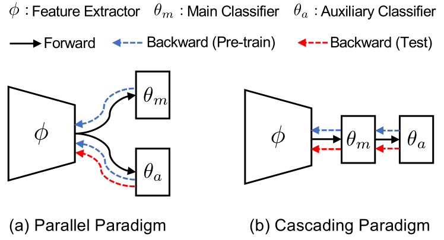
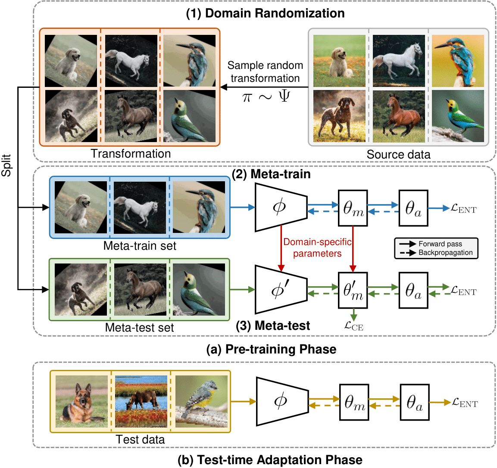

# [CIKM'24] Adaptive Cascading Network for Continual Test-time Adaptation

## Abstract

We study the problem of continual test-time adaption where the goal is to adapt a source pre-trained model to a sequence of unlabelled target domains at test time. Existing methods on test-time training suffer from several limitations: 
(1) Mismatch between the feature extractor and classifier; (2) Interference between the main and self-supervised tasks; (3) Lack of the ability to quickly adapt to the current distribution. 
In light of these challenges, we propose a cascading paradigm that simultaneously updates the feature extractor and classifier at test time, mitigating the mismatch between them and enabling long-term model adaptation. 
The pre-training of our model is structured within a meta-learning framework, thereby minimizing the interference between the main and self-supervised tasks and encouraging fast adaptation in the presence of limited unlabelled data.
Additionally, we introduce innovative evaluation metrics, *average accuracy* and *forward transfer*, to effectively measure the model's adaptation capabilities in dynamic, real-world scenarios.
Extensive experiments and ablation studies demonstrate the superiority of our approach in a range of tasks including image classification, text classification, and speech recognition.

<p align="center">
  
</p>

Figure 1: (a) Parallel paradigm for test-time training, and (b) our proposed cascading paradigm for continual test-time training. The proposed cascading paradigm efficiently mitigates the mismatch between the feature extractor and main classifier, enabling long-term model adaptation.


<p align="center">
  
</p>

Figure 2: Overview of pre-training and adaptation phases. $\pi \sim \Psi$ denotes a transformation randomly sampled from a predefined pool of transformations. $L_{\text{ENT}}$: entropy loss, $L_{\text{CE}}$: cross-entropy loss.

## How to Run the Code

1. Download CIFAR-10-C [here](https://zenodo.org/record/2535967#.Yv15kBzMIuU)

2. Unzip the file using
    
        tar -xvf CIFAR-10-C.tar

3. Move the unzipped ``CIFAR-10-C/`` folder into ``data/``

4. Run ``adapt.sh`` script. Pre-trained model ``069c8695_pretrained`` is provided in ``checkpoints/``

## Citation (BibTeX)

```
    @inproceedings{10.1145/3627673.3679801,
        author = {Nguyen, Kien X. and Qiao, Fengchun and Peng, Xi},
        title = {Adaptive Cascading Network for Continual Test-Time Adaptation},
        year = {2024},
        isbn = {9798400704369},
        publisher = {Association for Computing Machinery},
        address = {New York, NY, USA},
        url = {https://doi.org/10.1145/3627673.3679801},
        doi = {10.1145/3627673.3679801},
        booktitle = {Proceedings of the 33rd ACM International Conference on Information and Knowledge Management},
        pages = {1763–1773},
        numpages = {11},
        keywords = {continual test-time adaptation, self-supervised learning, transfer learning},
        location = {Boise, ID, USA},
        series = {CIKM '24}
    }
```